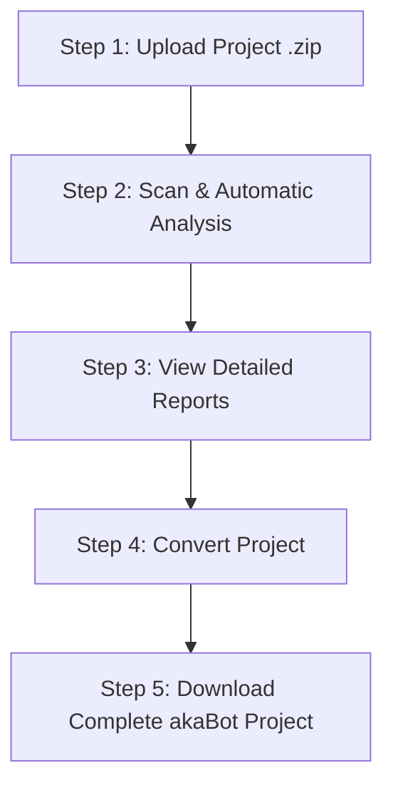

# akaBot Migration Tool

Welcome to the **akaBot Migration Tool** — a dedicated platform to analyze, evaluate complexity, and automatically convert RPA projects from other platforms (such as UiPath or Windows Workflow Foundation XAML) to the **akaBot** ecosystem.

This document provides a detailed, step-by-step guide for both **Users** and **Administrators** to operate the system running on the Cloud version at `https://migration.akabot.com/` (or locally at `http://localhost:8080`).

---

## **System Feature Map**

The akaBot Migration Tool is divided into 5 main functional modules:
1. **Dashboard**: Visually monitor system-wide KPIs and intuitive charts.
2. **Project Analyzer**: Upload, scan compatibility, estimate man-days, and automatically convert projects.
3. **Project Detail**: Perform deep analysis of activities, shared workflows, and project folder structures.
4. **Common Workflows**: View statistics and manage workflow reusability (Admin only).
5. **User Management**: Allocate accounts, assign permissions, and monitor user activities (Admin only).

---

## **1. Login & Initial Setup**

### **1.1. Login to the System**

1. Open your web browser and go to the Cloud version at `https://migration.akabot.com/` (or your local environment, e.g., `http://localhost:8080`). You will be automatically redirected to the login screen if you do not have an active session.
2. **Select Language**: The system supports **Vietnamese** and **English** (you can quickly switch using the flag language menu in the upper-right corner of the screen).
3. **Enter Login Credentials**:
   * **Administrator Account**:
     * *Username / Email*: `admin@akabot.com`
     * *Password*: `akabot-admin-change-me` (You can click the eye icon on the right to toggle password visibility).
   * **User Account**:
     * *Username / Email*: `user`
     * *Password*: `user`
4. Check the **Remember me** option if you want to maintain your login session longer.
5. Click the **Login** button to submit credentials for authentication.

**💡 Mechanism Details & Post-Login Check:**
* **Successful Authentication**: The system calls the `/api/login` API, receives a JWT Token, and automatically stores it in the browser's `localStorage` under the key `authenticationToken`. You will then be automatically redirected to the **Dashboard** home page. Your account name will be displayed in the top-right navigation bar.
* **Authentication Failure**: If you enter an incorrect email or password, a red error message will appear: *"Login failed! Please check your account and password again."* Please verify if Caps Lock is enabled or if your input method editor (IME) is modifying the password characters.

### **1.2. Profile Settings**
After logging in successfully, you can click on **Account** in the navigation bar to:
* **Settings**: Update your Full Name, Email, and Default Language.
* **Password**: Change your account's password.
* **Sessions**: Monitor active login sessions.

---

## **2. Dashboard & Core KPIs**

The **Dashboard** home page provides a comprehensive overview of the performance and scale of the RPA projects uploaded to the system.

### **2.1. Core KPIs**
* **Total Projects**: Total number of RPA projects successfully uploaded and stored in the system.
* **Estimated Effort**: Total estimated **Man-Days (MD)** required for a development team to manually convert all activities (displayed as a Min - Max range).
* **Total Process Points**: Total **Man-Months (MM)** required for conversion.
* **Total Workflows**: Total number of workflow files (`.xaml` or equivalent workflow files) across all projects.
* **Total Activities**: Total number of individual tasks/activities that make up the processes.
* **Total Conditions**: Total number of activities containing branching structures or logical conditions.

### **2.2. Interactive Charts**
* **Estimated Effort Bar Chart**: Compares the estimated effort (Man-Days) between projects to facilitate project resource management.
* **Complexity & Effort Scatter Chart**: Visualizes project complexity to identify which projects require more resources to process.

---

## **3. Project Analyzer**

This is the core feature of the tool, allowing users to automatically scan original RPA source code, analyze compatibility, and convert it to akaBot.

### **3.1. 5-Step Analysis & Conversion Workflow**

#### **Step 1: Upload Project**
1. Access the **Project Analyzer** page from the menu bar.
2. Click the **Upload Project** button in the upper-right corner.
3. In the pop-up dialog, drag and drop or select a compressed `.zip` file containing the entire source code directory of the original RPA project.
4. Click **Confirm / Save**.

#### **Step 2: Automatic Analysis (Scan)**
1. Immediately after a successful upload, the system automatically places the project in the queue and starts the **Scan** process.
2. The analysis status (`Scan Status`) will transition through:
   * **Analyzing**: The system is reading the XML/XAML structure, extracting activities, and identifying logical branching.
   * **Analyzed**: The analysis is successful. The system populates all metrics: *No. of Workflows, No. of Activities, No. of Conditions, Mapper to akaBot (%), and Estimated Effort*.
   * **Fail to Analyze**: Occurs if the zip file is corrupted or in an incorrect format. You can select **Re-analyze** or **Retry** from the three-dot `...` action menu at the end of the row.

#### **Step 3: View Detailed Analysis Reports**
Click on the **Project Name** or select **View Details** from the `...` action menu to open the deep analysis screen (see Section 4).

#### **Step 4: Convert Project to akaBot**
1. In the project list table, click the three-dot `...` action menu at the end of the successfully analyzed project row.
2. Select **Convert Project**.
3. The system will automatically map the old activities and convert the source code into corresponding **akaBot Studio** activities.

#### **Step 5: Export & Download Results**
* **Download Converted Project**: Click the `...` menu -> select **Export Converted** or **Export Convert Zip** to download a `.zip` file containing the complete akaBot project. You can open this project directly in **akaBot Studio** to continue development or testing.
* **Download Original Project**: Select **Download Original** to download the original `.zip` file that was uploaded.

---

## **4. Project Detail & Compatibility Assessment**

The project details screen provides deep analytical insights that help Project Managers and Developers evaluate the overall migration effort.

### **4.1. Top Panel Toolbar**
* **View Tree**: Click this link to display a visual tree diagram of all workflow files in the original project. This helps developers immediately understand the design architecture and data flow.
* **Export Analyzer Report**: Download a detailed Excel report containing a comprehensive list of each activity, its compatibility status, and migration recommendations.
* **Export Converted**: Quickly download the converted akaBot project as a zip file.
* **Convert**: Trigger the conversion process directly from the details page.

### **4.2. Project Metrics & Complexity Scatter Chart**
* A quick summary table displaying: *No. of Workflows, No. of Activities, No. of Conditions, Effort (Man-Days)*, and *Refinement Effort*.
* **Scatter Chart**: Plots the complexity of each individual workflow file within the project, helping you pinpoint the most complex workflows that require careful testing.

### **4.3. Activities Tab**
This tab lists every type of activity extracted from the project.
* **Smart Filters**:
   * Quick search by keywords (Workflow Name, Activity, Activity Group, Linked Application).
   * Filter by **Migration Status** (Converted, Not Started, etc.).
   * Filter by **Condition** (Whether it contains logical branching).
   * Filter by **Workflow Type**.
* **Key Columns**:
   * **Workflow**: The filename of the workflow containing the activity.
   * **Workflow Type**: Categorization of the processing flow.
   * **Activity / Activity Group**: The name of the original activity (e.g., `Sequence`, `Catch`, `Assign`) and its category.
   * **Condition**: Marked as "Yes" or "No" indicating if the activity has logical conditions.
   * **Application**: Identifies the target system or software interactively integrated (e.g., SAP, Excel, Chrome, Java, etc.).
   * **Quantity**: The frequency of occurrence of this activity in the workflow.
   * **Migration Status**: Compatibility level and automatic convertibility to akaBot.

### **4.4. Common Workflows Tab**
Lists all shared workflow files used internally within the project:
* **Workflow Name**: The name of the shared workflow.
* **No. of Uses in Project**: How many times this workflow is invoked inside the project.
* **Total No. of Uses**: The total invocation count across all projects under the customer account.
* **No. of Activities**: Total activities within that shared workflow.
* **Reused Effort (MD)**: The number of man-days saved by using a shared workflow instead of rewriting it from scratch.

---

## **5. System-wide Common Workflows**
*(Administrator feature only)*

This module helps organizations manage their RPA assets efficiently, detect duplicate workflows, optimize processes, and construct a Reusability Library.

1. Navigate to **Administration -> Common Workflows**.
2. **Advanced Filters**:
   * Filter by **Customer Account** (Account).
   * Filter by **Projects** (supports multi-project selection for cross-referencing).
   * Search by **Workflow Name**.
3. **Key Visual Metrics**:
   * **Workflow Name**: The name of the shared workflow.
   * **No. of Uses**: Total number of times this workflow is called (Invoked) across the entire system.
   * **No. of Projects**: Number of projects using this workflow (Click the number to display the list of project names).
   * **No. of Activities**: Number of activities in the workflow (Click the number to view the detailed list of activities).
   * **Raw Effort (MD)**: Original effort required to develop the workflow from scratch.
   * **Development Effort (MD)**: Actual development effort spent (after optimization).
   * **Reused Effort (MD)**: Total man-days saved for the enterprise through workflow reuse.
4. **Export Button**: Export the common workflows report to a professional Excel/PDF file.

---

## **6. User Management**
*(Administrator feature only)*

The system allows administrators to provision accounts for partners or business users to perform project migration and analysis.

1. Navigate to **Administration -> User Management**.
2. **User List**: Displays user information: *Name, Company, Phone Number, Email, Role (Group Permission)*, and *Activation Status*.
3. **Add User**:
   * Click the **Add User** button.
   * Enter all required fields: Full Name, Email, Phone Number, Company Name, Role (Admin or User), and Status (Active/Inactive).
   * Click **Save**.
4. **Edit / Deactivate Accounts**:
   * In the Actions column at the end of each row, select **Edit** to update user info or reset the password.
   * To temporarily suspend an account, toggle the status from **Activated** to **Deactivated**.
   * Select **Delete** to permanently remove an account from the system when it is no longer needed.

---

## **Important Notes**

> [!IMPORTANT]
> **Upload File Format (.zip)**  
> Ensure that the uploaded `.zip` archive maintains the original RPA project's directory structure (containing the `.xaml` files and the project configuration file like `project.json` in the root folder). Avoid nesting extra parent folders.

> [!TIP]
> **Optimize Migration Success Rate (Mapper to akaBot %)**  
> To achieve the highest automatic conversion rate, configure all custom activity mappings in the **Common Workflow Configuration** module before starting the conversion process.

> [!WARNING]
> **Evaluate Estimated Effort (Effort MD)**  
> The estimated effort (Man-Days - MD) is based on akaBot's standardized complexity evaluation algorithm. In practice, actual effort may vary slightly depending on developer skills and the complexity of third-party systems integrated (such as SAP, Mainframe, or high-security websites).
